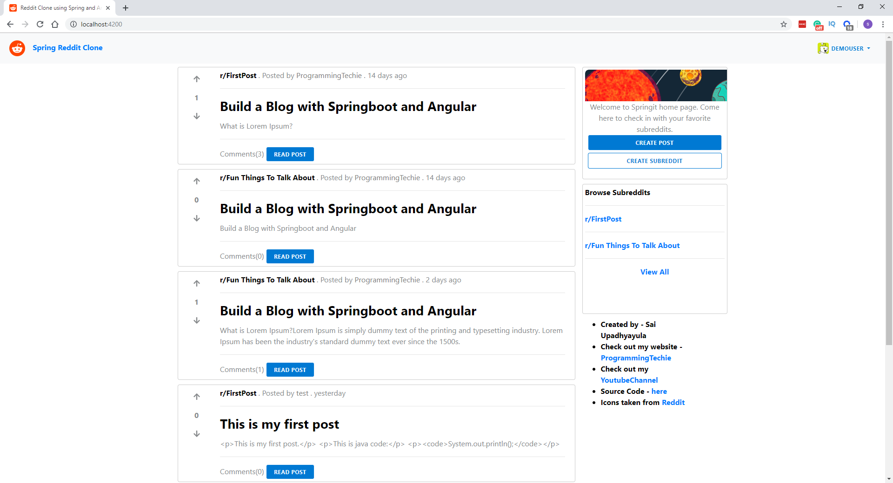
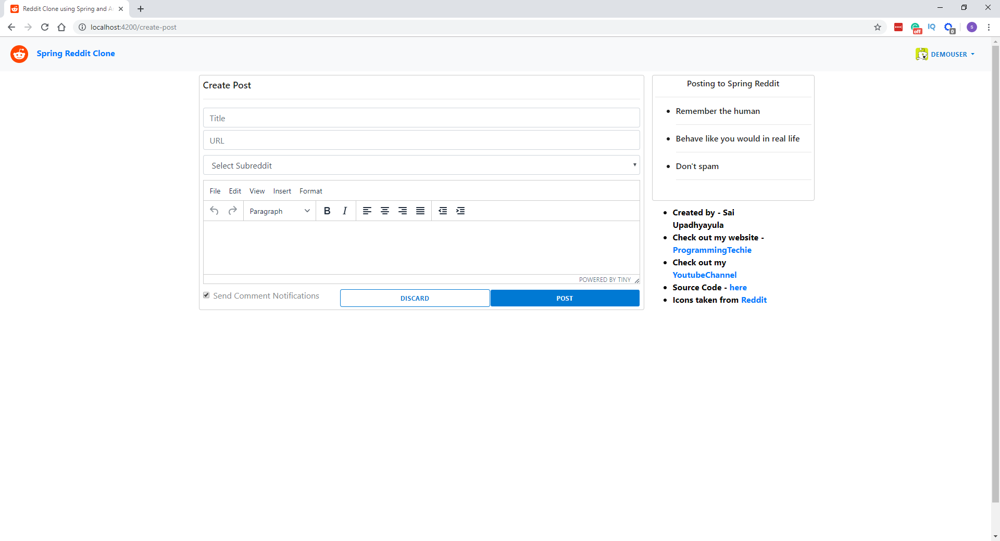
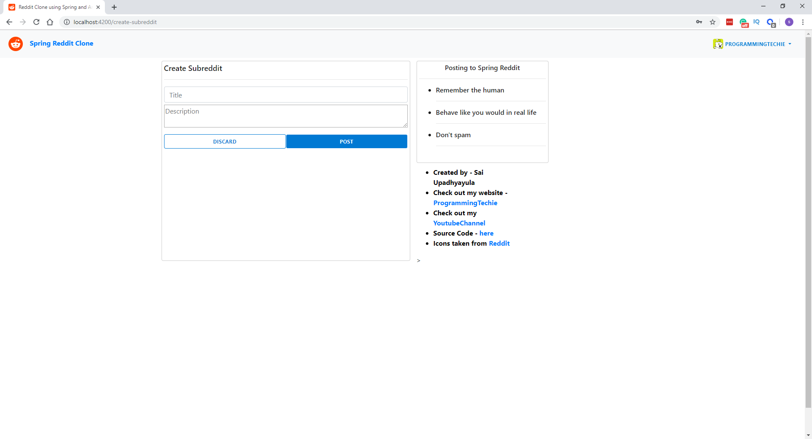
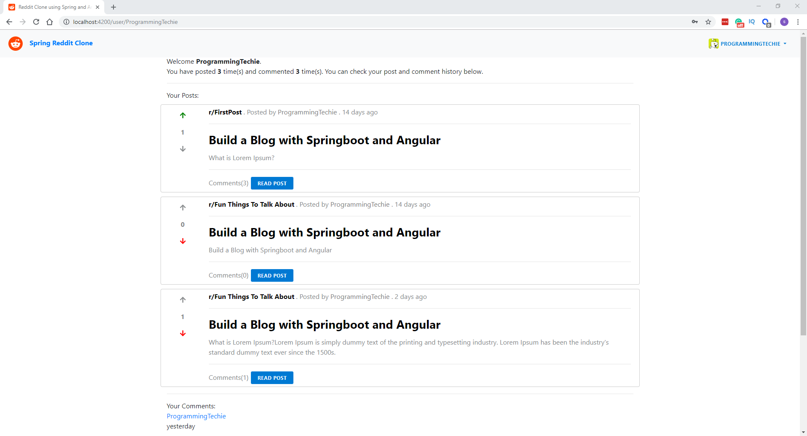

# reddit-clone
Reddit clone built using Spring Boot, Spring Security with JPA Authentication, Spring Data JPA with MySQL. The frontend is built using Angular

# Recent Updates
- Updated to latest spring boot version - 3.0.3
- Updated Spring Security to v6
- Replaced Spring Fox Rest api documentation library with OpenAPI 3

# Screenshots
1. Home Page

2. View Post Page

3. Create Post Page

4. Create Subreddit Page

5. User Profile Page

